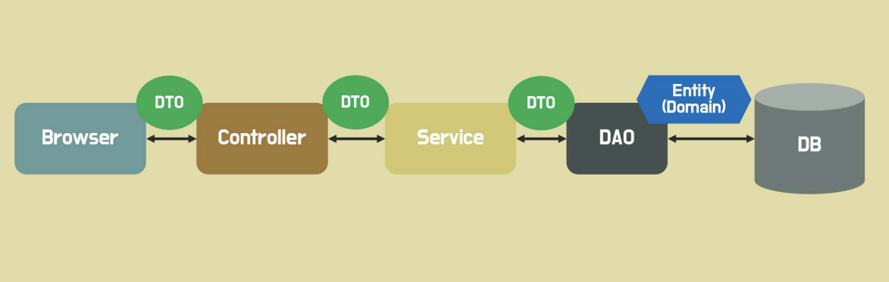
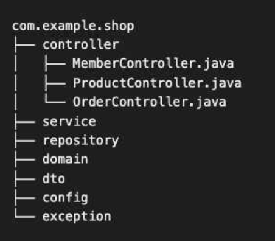
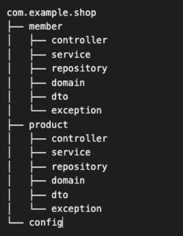
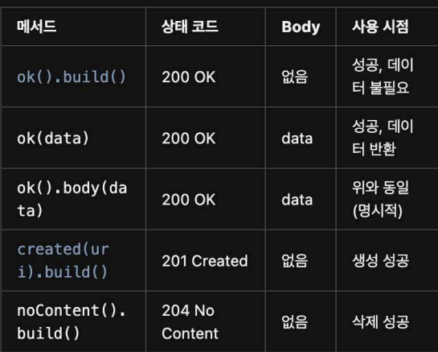

# GDG 백엔드 정규 스터디 2주차

## 1. Spring의 핵심 설계 : 계층형 아키텍처 (Layered Architecture)

**Browser**로부터 API 요청을 Controller가 먼저 받게 됨 (Browser는 Frontend)

**Controller (컨트롤러 계층)**

- Browser와 소통
- 비즈니스 로직을 전혀 모른다 -> 그래서 서비스한테 시킨다

**Service 계층**

- 비즈니스 로직을 알고 있는 계층
- 그러나 처리를 할 재료, **데이터**가 없다 -> 그래서 DAO에게 요청한다 (재료 줘!)

**DAO (Data Access Object) / Repository 계층**

- 데이터의 위치를 다 알고 있다
- 재료가 입고되면, 데이터가 추가되면 정리까지 해준다
- 꺼내는 것도 수월하게 한다

**DB (DataBase)**

- 창고. DAO가 데이터를 꺼내오는 곳

그래서 **DAO** -> **Service** : 비즈니스 로직으로 처리 (ex. 요리한다) -> **Controller** -> **Browser**

**DTO (Data Transfer Object)**

- 주문서 영수증과 같은 역할. 주문에 꼭 필요한 정보만 포함한다 (ex. 메뉴 이름, 수량 등)
- 소통 목적에 맞는, 필요한 정보만 전달해준다

**Entity**

- 모든 정보를 포함하고 있다 (주문에 필요한 정보 이외에도 ex. 유통기한, 원산지, 등급 등)
- DB 테이블과 매핑되는 핵심 객체
- 데이터 일관성과 보안을 위해서 외부에 직접 노출하지 않도록 한다

오늘은 컨트롤러와 서비스 계층을 자세히 알아본다

---

\[REVIEW\]

#### 프론트엔드와 백엔드

GET과 POST를 통해서 클라이언트가 정보를 받고 입력을 한다. 이때 상태코드를 통해서 전송 상태를 확인할 수 있다

#### API와 REST API

RESTful 한 API 설계 - API 명세서 작성

**path variable**
  URI 일부를 변수처럼 사용해서, 특정 자원을 식별하는 방식

---

### Controller Layer

- HTTP 요청 / 응답을 먼저 주고 받는 계층
- 특정 endpoint(URL)로 요청을 가장 먼저 처리한다
- DTO를 사용해서 서비스 계층과 데이터를 주고받는다

이때 HTTP body 쪽에는 키와 값의 쌍으로 된 포맷으로 전달을 하게 되는데, 이것이 **JSON** 이다.

### Controller 만들기

1. @Controller 어노테이션
2. @Responsebody 어노테이션
3. @RestController 어노테이션
4. 생성자 주입(서비스 계층에 의존)
5. @RequestMapping -> method, url 지정
6. 공통 URL & 상세 URL
7. @RequestBody를 통한 JSON 데이터 받아오기
    

### 패키지 구조: 계층형 VS 도메인형

 **계층형 구조**  
애플리케이션을 기능별로 나눈다
Controller는 Controller, Service는 Service에!

   

 **도메인형 구조**  

- 도메인과 관련된 모든 클래스를 포함시키는 구조이다
- 그래서 특정 도메인의 코드가 한곳에 모여있어 코드 탐색이 용이하다
- 도메인 단위로 개발이 이뤄지므로, 유지보수가 쉽다

우리는 이번 스터디에서는 도메인형 구조로 진행을 하는 것으로 한다

참고) ResponseEntity의 메서드  

### Service Layer

- 애플리케이션의 비즈니스 로직이 담기는 계층
- 엔티티 또는 DTO로 레포지토리 계층(DAO)와 소통한다

### 비즈니스 로직

Spring에서는 원자성(atomicity)이 보장되어야한다  
이를 위해서 트랜잭션 단위로 처리를 하면된다 -> 서비스 계층 메서드 위에 @transactional을 붙이면 된다

**JPA**(Java Persistence API)는 자바의 ORM 기술을 쉽게 구현하도록 도와주는 API
JPA를 사용하면 @transactional이 동작하는데, 우리는 2주차에서는 사용하지 않을 거기 때문에 주석 처리로만 한다

### 서비스 계층 구현하기

1. 생성자 주입
2. @transactional [2주차: 주석처리]
3. (readOnly = true) 옵션 => 조회만 하는 경우, 트랜잭션 내에서 데이터가 변경되지 않도록 readOnly 속성을 활성화

# 스프링 빈과 의존성 주입

스프링[내장 서버**톰캣** | 스프링 컨테이너]

### Spring Container

- 스프링 빈 저장소
- Application Context

**스프링 빈**

- 어플리케이션 전역에서 사용할 **공용 객체**
- 스프링 컨테이너 (공용창고)에 빈을 저장, 필요한 빈을 컨테이너에서 받아서 사용
- 필요한 빈은 스프링에서 자동으로 가져다 준다
- 빈을 요구하는 객체 역시 스프링 빈 즉 빈은 빈만 요구한다
- 빈은 설정파일작성(수동) 과 컴포넌트 스캔(자동)의 방식으로 등록할 수 있다

**컴포넌트 스캔(자동 등록)**

1. 컴포넌트 스캔 : @ComponentScan

- 어떤 클래스들이 Spring Bean인지 찾아서 등록

2. 컴포넌트 : @Component

- Spring Bean인 클래스들을 표시해준다

--> 그래서 빈으로 등록하고 싶은 클래스에 @Component를 붙이면 된다  
우리가 쓰는 프로젝트에서, @SpringBootApplication에 컴포넌트 스캔이 포함되어있어서 자동으로 Spring Bean인 클래스들을 찾게 된다  
이때 @Controller, @Service, @Reposiotry 등이 포함된다  
즉 빈으로 등록하기 위해서 포멧 시켜주는 annotation 이었던 것! 그래서 이 클래스가 스프링 빈이야라는 표시를 해준다

## 의존성 주입(Dependency Injection, DI)

내가 의존하는 객체를 직접 생성하지 않고 밖에서 주입을 받는것  
즉 빈이 빈을 요구해서, 빈을 가져올 수 있는 것  
**왜 쓰는가** : 매번 객체를 생성하기 보다, 생성한 객체를 재사용. 메모리 사용이 효율적이다!

### 의존성 주입 방법

1. 생성자 주입
2. 필드 주입
3. 수정자 주입 (Setter 주입)

#### 생성자 주입

1. 안전하게 final로 선언
   final : 변수에 한번만 값을 할당할 수 있게 하여 변경을 막음
2. 생성자에 @Autowired을 사용하면, 생성자를 통해 빈을 주입
3. 생성자가 하나라면 위 과정을 생략할 수 있다.
